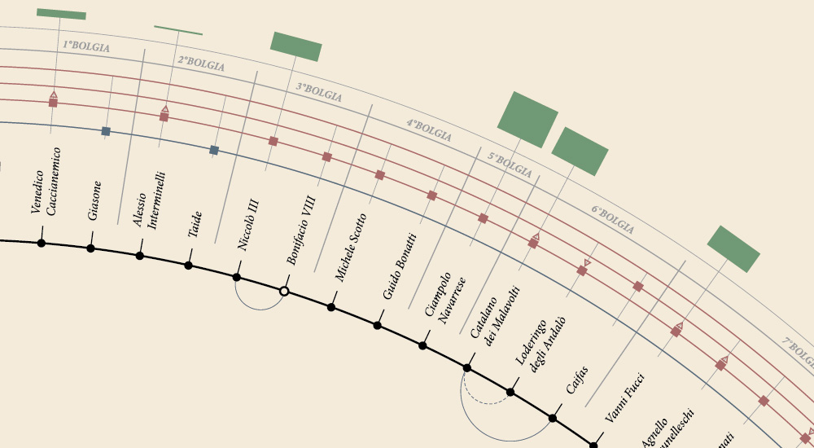
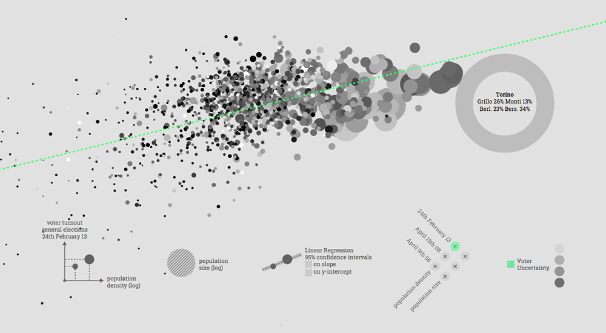

Ai + D3.js
=====

<figure>
  
  <figcaption>
  </figcaption>
</figure>

<figure>
  
  <figcaption>
  </figcaption>
</figure>

Adobe Illustrator (AI) e la libreria JavaScript D3.js sono strumenti utilizzati universalmente nell'ambito dell'*Information Design* e *Data Visualization*.

 Il corso trae spunto dalla difficoltà pratica da un lato di creare infografiche complesse con il solo uso di D3, dall'altro di introdurre transizioni dinamiche e data driven all'interno di infografiche create con AI.

Lo studente affronterà un percorso a step in cui l'uso di Adobe Illustrator e la manipolazione di codice Javascript D3 si susseguiranno più volte, al fine di ottenere un prodotto che sia frutto dell'unione dei due strumenti.

Il corso è rivolto a disegnatori grafici e programmatori frontend i quali desiderano:
avvicinarsi al mondo dell'Infografica mediante AI, avere competenze di Visualizzazione Dati mediante D3.js,
estendere le proprie competenze in AI con l'uso di Web Standards e D3.js, o viceversa.

Non sono previste conoscenze specifiche, se non una buona attitudine ad imparare. Il corso infatti prevede lo svolgimento di alcuni tutorial guidati che rimmarranno poi a disposizione dello studente.

E' invece necessario che gli studenti siano muniti di pc proprio, avente
[Adobe Illustrator](https://creative.adobe.com/it/products/download/illustrator),
un editor di testo, per esempio [Sublime Text](http://www.sublimetext.com/), ed un
web browser, per esempio [Chrome](https://www.google.it/chrome/browser/desktop/) o [Firefox](https://www.mozilla.org/it/firefox/new/)

Gli insegnanti sono [Riccardo Scalco](http://riccardoscalco.github.io/) ed [Emanuele Conti](http://visualpollutionlab.com/). I contenuti sono originali.

E' stata creata una mailing list per informazioni dell'ultimo momento :)

<!-- Begin MailChimp Signup Form -->

<form action="//seofon.us7.list-manage.com/subscribe/post?u=d69d948aecdb0a624ec410c24&amp;id=62bc97eea5" method="post" id="mc-embedded-subscribe-form" name="mc-embedded-subscribe-form" class="validate" target="_blank" novalidate>
    

	<h2></h2>

	<label for="mce-EMAIL"></label>
	<input type="email" value="" name="EMAIL" class="required email" id="mce-EMAIL">

	

		

		

	
    <!-- real people should not fill this in and expect good things - do not remove this or risk form bot signups-->
    
<input type="text" name="b_d69d948aecdb0a624ec410c24_62bc97eea5" tabindex="-1" value="">

    
<input type="submit" value="Subscribe" name="subscribe" id="mc-embedded-subscribe" class="button">

    

</form>

<!--End mc_embed_signup-->

--------------

Programma del corso
-------------------------

I tutorials sono in fase di preparazione, per cui alcuni punti potrebbero essere abbreviati o estesi.

*	**Intro HTML (R)**: Introduzione al linguaggio HTML • Campi `<meta>` • Regole di stile • Web semantico • Creazione di una pagina HTML

*	**Documentazione (R)**: W3C • Mozilla Developer Network • Webplatform • Attributi dei tag HTML • Tags `<section>` ,`<h1>` ed ``

*	**DOM (R)**:  Document Object Model • Developer Tools • Modifica delle regole di stile • Console JavaScript

*	**Intro D3 (R)**: Librerie JavaScript • Github • Panoramica su D3 • Tag `<script>` • Selezione nodi nel DOM • Inserzione o rimozione di nodi nel DOM • Modifica di attributi e stili dei nodi

*	**Creazione di un foglio AI (E)**: Profili del documento • Uso delle Tavole da Disegno

*	**Intro SVG in AI (E)**: Il formato SVG • L'approccio Object Oriented

*	**Fonts (E)**: Utilizzo dei font • Web fonts  

*	**SVG nel DOM (R)**: Tags `<svg>`,  ``,  `<iframe>` •  Selezione di nodi SVG • Inserzione di nodi SVG mediante D3

*	**ViewPort (R)**: Posizionamento degli elementi SVG • Trasformazioni: riscalamento, traslazione, rotazione

*	 **Figure semplici con AI (E)**: Elementi `line`, `rect`, `circle`, `polygon` e `polyline`

*	**Stile e attributi SVG in AI (E)**: Attributi di un oggetto vettoriale •  Codifica degli attributi di un oggetto vettoriale nel file SVG • Stili di Grafica • Pannello Ricolora Grafica • Librerie di campioni colore: Adobe Kuler

*	**Trasformazione elementi SVG in AI (E)**: Spostamento, Rotazione, Riflessione, Ridimensionamento, Inclinazione

*	**Codice SVG generato da AI (E)**: Opzioni di Esportazione SVG

*	**Selezioni dentro iframes (R)**: Selezioni elementi SVG • Inserzioni di nuovi elementi • Modifica di attributi e stile

*	**Transizioni D3 (R)**: Durata • Ritardo • Stato iniziale • Stato finale • Funzione di easing

*	**Animazioni SVG (E)**: Tag `<animate>` • `<animateMotion>` • `<animateTransform>`

*	**DataJoin (R)**: Selezioni `enter`, `exit` e `update` • Transizioni data-driven

*	**Scale D3 (R)**: Scale lineari e quadratiche • Scale Temporali

*	**Figure Complesse con AI (E)**: Elemento `<path>`, bezier curves

*	**Transizioni di figure complesse (E,R)** Transitioni non data-driven • Transizioni data-driven
